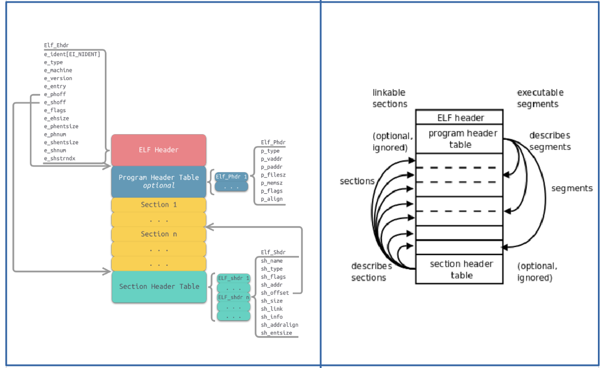

[toc]

# 目标

实现目标：查看某个`readline`函数在`/bin/bash`中的偏移量。

方法一：使用`readelf`命令，从符号表中查看偏移量。可以看到偏移量为`00000000000b8520 `。

```shell
➜  readelf --symbols /bin/bash | grep readline
882: 00000000000b8520   154 FUNC    GLOBAL DEFAULT   16 readline
```

方法二：使用`libelf`解析elf文件，从符号表中查看偏移量。可以看到偏移量为`754976`=`0Xb8520 `。<font color=red>代码来源</font>：[**uprobe_helpers.c**](https://github.com/iovisor/bcc/blob/master/libbpf-tools/uprobe_helpers.c)

```shell
➜  make
➜  ./get_elf_func_offset 
754976
```

# 背景介绍

参考一：[计算机那些事(4)——ELF文件结构](http://chuquan.me/2018/05/21/elf-introduce/)、[ELF文件格式简介](https://terenceli.github.io/%E6%8A%80%E6%9C%AF/2014/11/02/elf)、[readelf命令](https://wangchujiang.com/linux-command/c/readelf.html)、

参考二：[elf -- FreeBSD Manual Pages](https://www.freebsd.org/cgi/man.cgi?query=elf&apropos=0&sektion=3&manpath=FreeBSD+14.0-current&arch=default&format=html)、[elf(5) — Linux manual page](https://man7.org/linux/man-pages/man5/elf.5.html)

参考三：[elfutils -- source code](https://sourceware.org/elfutils/)



---

# 代码分析

头文件中需要关注的是`<gelf.h>`。该头文件定义了基本的ELF 类型，结构和宏。`<gelf.h>`包含了`<libelf.h>`，其为`libelf`的接口。

```c
#include <stdio.h>
#include <gelf.h>
#include <sys/types.h>
#include <sys/stat.h>
#include <fcntl.h>
#include <unistd.h>
#include <string.h>
```

宏定义了一个将相关信息输出到错误输出。

```c
#define warn(...) fprintf(stderr, __VA_ARGS__)
```

## 打开关闭elf文件

elf相关操作的第一步是调用[elf_version()](https://www.freebsd.org/cgi/man.cgi?query=elf_version&sektion=3&apropos=0&manpath=FreeBSD+7.1-RELEASE)函数 -- retrieve or set ELF library operating version。

[elf_begin()](https://www.freebsd.org/cgi/man.cgi?query=elf_begin&apropos=0&sektion=3&manpath=FreeBSD+7.1-RELEASE&arch=default&format=html)函数用以打开ELF 文件。`ELF_C_READ`表示打开方式为只读。

[elf_kind()](https://www.freebsd.org/cgi/man.cgi?query=elf_kind&apropos=0&sektion=3&manpath=FreeBSD+7.1-RELEASE&arch=default&format=html)函数用来检查打开的ELF文件类型。`ELF_K_ELF`表示为ELF文件。

```c
/*
 * Opens an elf at `path` of kind ELF_K_ELF.  Returns NULL on failure.  On
 * success, close with close_elf(e, fd_close).
 */
Elf *open_elf(const char *path, int *fd_close)
{
	int fd;
	Elf *e;

	if (elf_version(EV_CURRENT) == EV_NONE) {
		warn("elf init failed\n");
		return NULL;
	}
	fd = open(path, O_RDONLY);
	if (fd < 0) {
		warn("Could not open %s\n", path);
		return NULL;
	}
	e = elf_begin(fd, ELF_C_READ, NULL);
	if (!e) {
		warn("elf_begin failed: %s\n", elf_errmsg(-1));
		close(fd);
		return NULL;
	}
	if (elf_kind(e) != ELF_K_ELF) {
		warn("elf kind %d is not ELF_K_ELF\n", elf_kind(e));
		elf_end(e);
		close(fd);
		return NULL;
	}
	*fd_close = fd;
	return e;
}
```

[elf_end()](https://www.freebsd.org/cgi/man.cgi?query=elf_end&apropos=0&sektion=3&manpath=FreeBSD+7.1-RELEASE&arch=default&format=html)函数，释放ELF descriptor。

```c
void close_elf(Elf *e, int fd_close)
{
	elf_end(e);
	close(fd_close);
}
```

---

## 获取函数在elf中的偏移量

思路：遍历sections以找到符号表 -- 借助string table，从符号表中找到偏移量 -- 检查是否合法。

### 获取elf文件头

[gelf_getehdr()](https://www.freebsd.org/cgi/man.cgi?query=gelf_getehdr&apropos=0&sektion=3&manpath=FreeBSD+7.1-RELEASE&arch=default&format=html)函数从Elf文件描述符`e`中提取出文件头信息。

```c
	Elf *e;
	GElf_Ehdr ehdr;
	e = open_elf(path, &fd);

	if (!gelf_getehdr(e, &ehdr))
		goto out;
```

elf文件头信息的存储结构体`GElf_Ehdr`如下所示：

```c
typedef struct
{
  unsigned char	e_ident[EI_NIDENT];	/* Magic number and other info */
  Elf64_Half	e_type;			/* Object file type */
  Elf64_Half	e_machine;		/* Architecture */
  Elf64_Word	e_version;		/* Object file version */
  Elf64_Addr	e_entry;		/* Entry point virtual address */
  Elf64_Off	e_phoff;		/* Program header table file offset */
  Elf64_Off	e_shoff;		/* Section header table file offset */
  Elf64_Word	e_flags;		/* Processor-specific flags */
  Elf64_Half	e_ehsize;		/* ELF header size in bytes */
  Elf64_Half	e_phentsize;		/* Program header table entry size */
  Elf64_Half	e_phnum;		/* Program header table entry count */
  Elf64_Half	e_shentsize;		/* Section header table entry size */
  Elf64_Half	e_shnum;		/* Section header table entry count */
  Elf64_Half	e_shstrndx;		/* Section header string table index */
} Elf64_Ehdr;
```

文件头信息使用如下面命令查看：

```shell
➜ readelf -h /bin/bash
ELF 头：
  Magic：   7f 45 4c 46 02 01 01 00 00 00 00 00 00 00 00 00 
  类别:                              ELF64
  数据:                              2 补码，小端序 (little endian)
  Version:                           1 (current)
  OS/ABI:                            UNIX - System V
  ABI 版本:                          0
  类型:                              DYN (共享目标文件)
  系统架构:                          Advanced Micro Devices X86-64
  版本:                              0x1
  入口点地址：               0x30430
  程序头起点：          64 (bytes into file)
  Start of section headers:          1181528 (bytes into file)
  标志：             0x0
  Size of this header:               64 (bytes)
  Size of program headers:           56 (bytes)
  Number of program headers:         13
  Size of section headers:           64 (bytes)
  Number of section headers:         30
  Section header string table index: 29
```

其中，`e_shstrndx`就表示`.shstrtab`在段表中的下标。`.shstrtab`中主要存储的是段的名称。

可以使用如下命令查看`/bin/bash`的`.shstrtab`在段表中的下标：

```shell
readelf --section-details /bin/bash
...
  [29] .shstrtab
       STRTAB           0000000000000000  0000000000120638  0
       000000000000011d 0000000000000000  0                 1
       [0000000000000000]: 
```

### 读取.shstrtab段下标

[elf_getshdrstrndx()](https://www.freebsd.org/cgi/man.cgi?query=elf_getshdrstrndx&apropos=0&sektion=3&manpath=FreeBSD+14.0-current&arch=default&format=html)函数提取段名字符串(section name string	table)所在下标。

```c
size_t shstrndx;
if (elf_getshdrstrndx(e, &shstrndx) != 0)
		goto out;
```

### 遍历sections->section头信息->找到符号表类型的section->遍历section中(data)->遍历data->从string table中查找符号

[elf_nextscn()](https://www.freebsd.org/cgi/man.cgi?query=elf_nextscn&apropos=0&sektion=3&manpath=FreeBSD+14.0-current&arch=default&format=html)函数，以迭代的方式取得指向section descriptor的指针。

[gelf_getshdr()](https://www.freebsd.org/cgi/man.cgi?query=gelf_getshdr&apropos=0&sektion=3&manpath=FreeBSD+14.0-current&arch=default&format=html)函数，提取section头信息。头信息的结构体如下：

```c
typedef struct
{
  Elf64_Word	sh_name;		/* Section name (string tbl index) */
  Elf64_Word	sh_type;		/* Section type */
  Elf64_Xword	sh_flags;		/* Section flags */
  Elf64_Addr	sh_addr;		/* Section virtual addr at execution */
  Elf64_Off	sh_offset;		/* Section file offset */
  Elf64_Xword	sh_size;		/* Section size in bytes */
  Elf64_Word	sh_link;		/* Link to another section */
  Elf64_Word	sh_info;		/* Additional section information */
  Elf64_Xword	sh_addralign;		/* Section alignment */
  Elf64_Xword	sh_entsize;		/* Entry size if section holds table */
} Elf64_Shdr;
```

查找`shdr->sh_type`类型为`SHT_SYMTAB`符号表，或`SHT_DYNSYM`动态符号表。符号表存储在`.symtab`节中，是一个`ElfN_Sym`的数组，保存了符号信息。动态符号表存储在`.dynsym`节，保存在`text`段中。其保存了从共享库导入的动态符号表。`.dynsym`保存了引用来自外部文件符号的全局符号。如`printf`库函数。`.dynsym`保存的符号是`.symtab`所保存符合的子集，`.symtab`中还保存了可执行文件的本地符号。如全局变量，代码中定义的本地函数等。

[elf_getdata()](https://www.freebsd.org/cgi/man.cgi?query=elf_getdata&apropos=0&sektion=3&manpath=FreeBSD+14.0-current&arch=default&format=html)函数，迭代遍历section中的data。

[gelf_getsym()](https://www.freebsd.org/cgi/man.cgi?query=gelf_getsym&apropos=0&sektion=3&manpath=FreeBSD+14.0-current&arch=default&format=html)函数，从data中提取符号信息(symbol information)。符号信息的结构体如下：

```c
typedef struct
{
  Elf64_Word	st_name;		/* Symbol name (string tbl index) */
  unsigned char	st_info;		/* Symbol type and binding */
  unsigned char st_other;		/* Symbol visibility */
  Elf64_Section	st_shndx;		/* Section index */
  Elf64_Addr	st_value;		/* Symbol value */
  Elf64_Xword	st_size;		/* Symbol size */
} Elf64_Sym;
```

可以看到，符号的名称存储在string table的`sym->st_name`下标位置。且当section类型为符号表类型时，`shdr->sh_link`指向string table。

[elf_strptr()](https://www.freebsd.org/cgi/man.cgi?query=elf_strptr&apropos=0&sektion=3&manpath=FreeBSD+14.0-current&arch=default&format=html)函数，从string table中，提取string pointer。`GELF_ST_TYPE`用以提取符号的类型，判断是否为`STT_FUNC`(The symbol is associated with a function or other executable code.)  `sym->st_value`中存储着code的偏移量。


```c
	Elf *e;
	Elf_Scn *scn;
	Elf_Data *data;
	GElf_Ehdr ehdr;
	GElf_Shdr shdr[1];
	GElf_Phdr phdr;
	GElf_Sym sym[1];
	size_t shstrndx, nhdrs;
	char *n;

	scn = NULL;
	while ((scn = elf_nextscn(e, scn))) {
		if (!gelf_getshdr(scn, shdr))
			continue;
		if (!(shdr->sh_type == SHT_SYMTAB || shdr->sh_type == SHT_DYNSYM))
			continue;
		data = NULL;
		while ((data = elf_getdata(scn, data))) {
			for (i = 0; gelf_getsym(data, i, sym); i++) {
				n = elf_strptr(e, shdr->sh_link, sym->st_name);
				if (!n)
					continue;
				if (GELF_ST_TYPE(sym->st_info) != STT_FUNC)
					continue;
				if (!strcmp(n, func)) {
					ret = sym->st_value;
					goto check;
				}
			}
		}
	}
```

可以使用如下命令查看sections信息：

```shell
readelf --section-details /bin/bash
```

可以使用如下命令查看sections header信息：

```shell
readelf --section-headers /bin/bash
There are 30 section headers, starting at offset 0x120758:

节头：
  [号] 名称              类型             地址              偏移量
       大小              全体大小          旗标   链接   信息   对齐
  [ 0]                   NULL             0000000000000000  00000000
       0000000000000000  0000000000000000           0     0     0
  [ 1] .interp           PROGBITS         0000000000000318  00000318
       000000000000001c  0000000000000000   A       0     0     1
  [ 2] .note.gnu.propert NOTE             0000000000000338  00000338
       0000000000000020  0000000000000000   A       0     0     8
  [ 3] .note.gnu.build-i NOTE             0000000000000358  00000358
       0000000000000024  0000000000000000   A       0     0     4
  [ 4] .note.ABI-tag     NOTE             000000000000037c  0000037c
       0000000000000020  0000000000000000   A       0     0     4
  [ 5] .gnu.hash         GNU_HASH         00000000000003a0  000003a0
       0000000000004aac  0000000000000000   A       6     0     8
  [ 6] .dynsym           DYNSYM           0000000000004e50  00004e50
       000000000000e418  0000000000000018   A       7     1     8
  [ 7] .dynstr           STRTAB           0000000000013268  00013268
       0000000000009740  0000000000000000   A       0     0     1
  [ 8] .gnu.version      VERSYM           000000000001c9a8  0001c9a8
       0000000000001302  0000000000000002   A       6     0     2
  [ 9] .gnu.version_r    VERNEED          000000000001dcb0  0001dcb0
       00000000000000d0  0000000000000000   A       7     3     8
  [10] .rela.dyn         RELA             000000000001dd80  0001dd80
       000000000000dc80  0000000000000018   A       6     0     8
  [11] .rela.plt         RELA             000000000002ba00  0002ba00
       0000000000001470  0000000000000018  AI       6    25     8
  [12] .init             PROGBITS         000000000002d000  0002d000
       000000000000001b  0000000000000000  AX       0     0     4
  [13] .plt              PROGBITS         000000000002d020  0002d020
       0000000000000db0  0000000000000010  AX       0     0     16
  [14] .plt.got          PROGBITS         000000000002ddd0  0002ddd0
       0000000000000030  0000000000000010  AX       0     0     16
  [15] .plt.sec          PROGBITS         000000000002de00  0002de00
       0000000000000da0  0000000000000010  AX       0     0     16
  [16] .text             PROGBITS         000000000002eba0  0002eba0
       00000000000aeb55  0000000000000000  AX       0     0     16
  [17] .fini             PROGBITS         00000000000dd6f8  000dd6f8
       000000000000000d  0000000000000000  AX       0     0     4
  [18] .rodata           PROGBITS         00000000000de000  000de000
       000000000001a094  0000000000000000   A       0     0     32
  [19] .eh_frame_hdr     PROGBITS         00000000000f8094  000f8094
       00000000000044dc  0000000000000000   A       0     0     4
  [20] .eh_frame         PROGBITS         00000000000fc570  000fc570
       0000000000017c28  0000000000000000   A       0     0     8
  [21] .init_array       INIT_ARRAY       0000000000115cf0  00114cf0
       0000000000000008  0000000000000008  WA       0     0     8
  [22] .fini_array       FINI_ARRAY       0000000000115cf8  00114cf8
       0000000000000008  0000000000000008  WA       0     0     8
  [23] .data.rel.ro      PROGBITS         0000000000115d00  00114d00
       00000000000028f0  0000000000000000  WA       0     0     32
  [24] .dynamic          DYNAMIC          00000000001185f0  001175f0
       0000000000000210  0000000000000010  WA       7     0     8
  [25] .got              PROGBITS         0000000000118800  00117800
       00000000000007e8  0000000000000008  WA       0     0     8
  [26] .data             PROGBITS         0000000000119000  00118000
       0000000000008604  0000000000000000  WA       0     0     32
  [27] .bss              NOBITS           0000000000121620  00120604
       0000000000009c78  0000000000000000  WA       0     0     32
  [28] .gnu_debuglink    PROGBITS         0000000000000000  00120604
       0000000000000034  0000000000000000           0     0     4
  [29] .shstrtab         STRTAB           0000000000000000  00120638
       000000000000011d  0000000000000000           0     0     1
Key to Flags:
  W (write), A (alloc), X (execute), M (merge), S (strings), I (info),
  L (link order), O (extra OS processing required), G (group), T (TLS),
  C (compressed), x (unknown), o (OS specific), E (exclude),
  l (large), p (processor specific)
```

下面对其中的一些进行简单的介绍:

- .interp保存了解释器的文件名，这是一个ASCII字符串
- .data保存初始化的数据，这是普通程序数据一部分，可以再程序运行时修改
- .rodata保存了只读数据，可以读取但不能修改。例如，编译器将出现在printf语句中的所有静态字符串封装到该节
- .init和.fini保存了进程初始化和结束所用的代码，这两个节通常都是由编译器自动添加
- .gnu.hash是一个散列表，允许在不对全表元素进行线性搜索的情况下，快速访问所有的符号表项

可以使用下面命令查看符号信息：

```shell
➜  readelf --symbols /bin/bash | grep readline
...
882: 00000000000b8520   154 FUNC    GLOBAL DEFAULT   16 readline
...
```

### 遍历program headers

最后需要检查下该偏移位置在程序段中。

[elf_getphdrnum()](https://www.freebsd.org/cgi/man.cgi?query=elf_getphdrnum&apropos=0&sektion=3&manpath=FreeBSD+14.0-current&arch=default&format=html)函数返回program headers的数量。使用[gelf_getphdr()](https://www.freebsd.org/cgi/man.cgi?query=gelf_getphdr&apropos=0&sektion=3&manpath=FreeBSD+14.0-current&arch=default&format=html)函数，获取程序头。检查类型为`PT_LOAD`(a loadable segment)，flag为`PF_X`(An executable segment)。偏移量位于program header中间。

```c
check:
	if (ehdr.e_type == ET_EXEC || ehdr.e_type == ET_DYN) {
		if (elf_getphdrnum(e, &nhdrs) != 0) {
			ret = -1;
			goto out;
		}
		for (i = 0; i < (int)nhdrs; i++) {
			if (!gelf_getphdr(e, i, &phdr))
				continue;
			if (phdr.p_type != PT_LOAD || !(phdr.p_flags & PF_X))
				continue;
			if (phdr.p_vaddr <= ret && ret < (phdr.p_vaddr + phdr.p_memsz)) {
				ret = ret - phdr.p_vaddr + phdr.p_offset;
				goto out;
			}
		}
		ret = -1;
	}
out:
	close_elf(e, fd);
	return ret;
}
```

可以使用下面命令查看program headers

```shell
➜  ~ readelf --program-headers   /bin/bash  

Elf 文件类型为 DYN (共享目标文件)
Entry point 0x30430
There are 13 program headers, starting at offset 64

程序头：
  Type           Offset             VirtAddr           PhysAddr
                 FileSiz            MemSiz              Flags  Align
  PHDR           0x0000000000000040 0x0000000000000040 0x0000000000000040
                 0x00000000000002d8 0x00000000000002d8  R      0x8
  INTERP         0x0000000000000318 0x0000000000000318 0x0000000000000318
                 0x000000000000001c 0x000000000000001c  R      0x1
      [Requesting program interpreter: /lib64/ld-linux-x86-64.so.2]
  LOAD           0x0000000000000000 0x0000000000000000 0x0000000000000000
                 0x000000000002ce70 0x000000000002ce70  R      0x1000
  LOAD           0x000000000002d000 0x000000000002d000 0x000000000002d000
                 0x00000000000b0705 0x00000000000b0705  R E    0x1000
  LOAD           0x00000000000de000 0x00000000000de000 0x00000000000de000
                 0x0000000000036198 0x0000000000036198  R      0x1000
  LOAD           0x0000000000114cf0 0x0000000000115cf0 0x0000000000115cf0
                 0x000000000000b914 0x00000000000155a8  RW     0x1000
  DYNAMIC        0x00000000001175f0 0x00000000001185f0 0x00000000001185f0
                 0x0000000000000210 0x0000000000000210  RW     0x8
  NOTE           0x0000000000000338 0x0000000000000338 0x0000000000000338
                 0x0000000000000020 0x0000000000000020  R      0x8
  NOTE           0x0000000000000358 0x0000000000000358 0x0000000000000358
                 0x0000000000000044 0x0000000000000044  R      0x4
  GNU_PROPERTY   0x0000000000000338 0x0000000000000338 0x0000000000000338
                 0x0000000000000020 0x0000000000000020  R      0x8
  GNU_EH_FRAME   0x00000000000f8094 0x00000000000f8094 0x00000000000f8094
                 0x00000000000044dc 0x00000000000044dc  R      0x4
  GNU_STACK      0x0000000000000000 0x0000000000000000 0x0000000000000000
                 0x0000000000000000 0x0000000000000000  RW     0x10
  GNU_RELRO      0x0000000000114cf0 0x0000000000115cf0 0x0000000000115cf0
                 0x0000000000003310 0x0000000000003310  R      0x1
```


---

# 附录

## 查看elf结构中函数偏移量的完整代码

```c
// SPDX-License-Identifier: (LGPL-2.1 OR BSD-2-Clause)
/* Copyright (c) 2021 Google LLC. */
#include <stdio.h>
#include <gelf.h>
#include <sys/types.h>
#include <sys/stat.h>
#include <fcntl.h>
#include <unistd.h>
#include <string.h>

#define warn(...) fprintf(stderr, __VA_ARGS__)
/*
 * Opens an elf at `path` of kind ELF_K_ELF.  Returns NULL on failure.  On
 * success, close with close_elf(e, fd_close).
 */
Elf *open_elf(const char *path, int *fd_close)
{
	int fd;
	Elf *e;

	if (elf_version(EV_CURRENT) == EV_NONE) {
		warn("elf init failed\n");
		return NULL;
	}
	fd = open(path, O_RDONLY);
	if (fd < 0) {
		warn("Could not open %s\n", path);
		return NULL;
	}
	e = elf_begin(fd, ELF_C_READ, NULL);
	if (!e) {
		warn("elf_begin failed: %s\n", elf_errmsg(-1));
		close(fd);
		return NULL;
	}
	if (elf_kind(e) != ELF_K_ELF) {
		warn("elf kind %d is not ELF_K_ELF\n", elf_kind(e));
		elf_end(e);
		close(fd);
		return NULL;
	}
	*fd_close = fd;
	return e;
}


void close_elf(Elf *e, int fd_close)
{
	elf_end(e);
	close(fd_close);
}


/* Returns the offset of a function in the elf file `path`, or -1 on failure. */
off_t get_elf_func_offset(const char *path, const char *func)
{
	off_t ret = -1;
	int i, fd = -1;
	Elf *e;
	Elf_Scn *scn;
	Elf_Data *data;
	GElf_Ehdr ehdr;
	GElf_Shdr shdr[1];
	GElf_Phdr phdr;
	GElf_Sym sym[1];
	size_t shstrndx, nhdrs;
	char *n;

	e = open_elf(path, &fd);

	if (!gelf_getehdr(e, &ehdr))
		goto out;

	if (elf_getshdrstrndx(e, &shstrndx) != 0)
		goto out;

	scn = NULL;
	while ((scn = elf_nextscn(e, scn))) {
		if (!gelf_getshdr(scn, shdr))
			continue;
		if (!(shdr->sh_type == SHT_SYMTAB || shdr->sh_type == SHT_DYNSYM))
			continue;
		data = NULL;
		while ((data = elf_getdata(scn, data))) {
			for (i = 0; gelf_getsym(data, i, sym); i++) {
				n = elf_strptr(e, shdr->sh_link, sym->st_name);
				if (!n)
					continue;
				if (GELF_ST_TYPE(sym->st_info) != STT_FUNC)
					continue;
				if (!strcmp(n, func)) {
					ret = sym->st_value;
					goto check;
				}
			}
		}
	}

check:
	if (ehdr.e_type == ET_EXEC || ehdr.e_type == ET_DYN) {
		if (elf_getphdrnum(e, &nhdrs) != 0) {
			ret = -1;
			goto out;
		}
		for (i = 0; i < (int)nhdrs; i++) {
			if (!gelf_getphdr(e, i, &phdr))
				continue;
			if (phdr.p_type != PT_LOAD || !(phdr.p_flags & PF_X))
				continue;
			if (phdr.p_vaddr <= ret && ret < (phdr.p_vaddr + phdr.p_memsz)) {
				ret = ret - phdr.p_vaddr + phdr.p_offset;
				goto out;
			}
		}
		ret = -1;
	}
out:
	close_elf(e, fd);
	return ret;
}

int main(void){
    const char *bash_path = "/bin/bash";
    off_t func_off;
    func_off = get_elf_func_offset(bash_path, "readline");
    if(func_off != -1)
        printf("%ld\n",func_off);
    return 0;
}
```

编译过程如下：

```makefile
.PHONY:all

all:get_elf_func_offset

get_elf_func_offset:get_elf_func_offset.c
	gcc  $^ -lelf -o $@

.PHONY:clean

clean:
	rm -rf get_elf_func_offset
```

